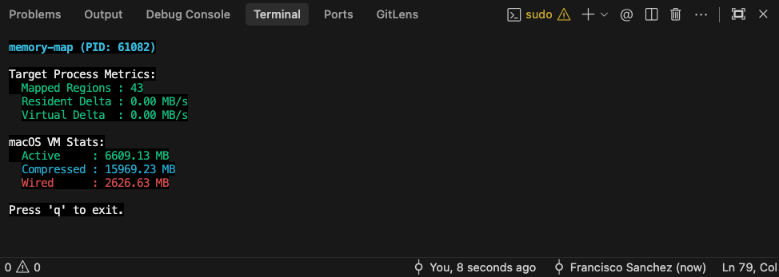

# memory-map

A macOS memory map tracker that monitors process memory regions and displays realtime metrics such as resident/virtual memory deltas and global VM statistics.



## Metrics Explained

**Target Process Metrics**
- **Mapped Regions**: Number of distinct memory segments mapped by the process.
- **Resident Delta**: Change in actual physical RAM used (RSS).
- **Virtual Delta**: Change in total address space allocated (VSZ).

**macOS Global VM Stats**
- **Active**: Physical memory currently in use.
- **Compressed**: Memory compressed by macOS to free up RAM.
- **Wired**: Core system memory locked in physical RAM.

## Usage

Build the project:
```bash
zip build
```

Run the program:
```bash
sudo ./zig-out/bin/memory-map <pid>
```

Note: look for the PID of the process you want to monitor using `ps aux | grep <process_name>`

## License

This project is licensed under the MIT License, see the [LICENSE](LICENSE) file for details.
